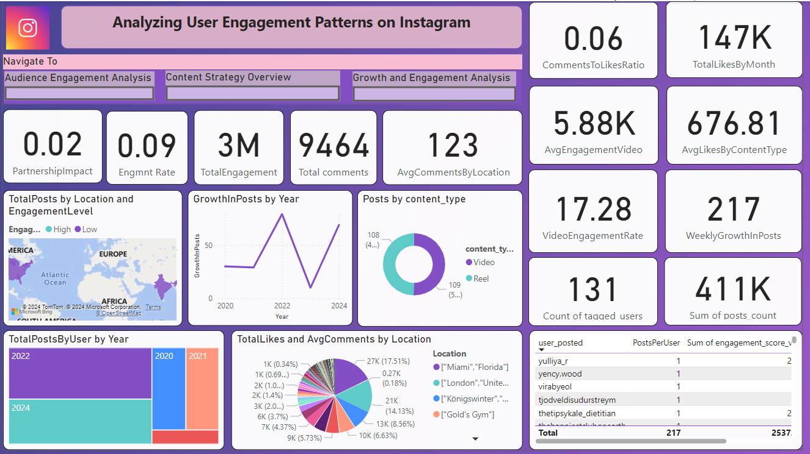

# Analyzing-User-Engagement-Patterns-on-Instagram

A comprehensive project to analyze Instagram account performance using **Power BI** and **Python**. This repository includes:
- A dataset for Instagram metrics
- A Power BI dashboard for interactive analytics
- Exploratory Data Analysis (EDA) using Python for deeper insights

The primary goal of this dashboard is to analyze user engagement on Instagram posts, providing insights that can enhance content strategy, optimize posting schedules, and improve audience interaction based on data-driven findings.

## Table of Contents
- [Project Overview](#project-overview)
- [Features](#features)
- [Installation](#installation)
- [Usage](#usage)
- [Dataset](#dataset)
- [Results](#results)
- [Contributing](#contributing)
- [License](#license)
    

## Project Overview

This project analyzes Instagram performance by leveraging:
1. **Dataset**: Raw data containing engagement metrics, follower trends, and content performance.
2. **Power BI Dashboard**: An interactive dashboard to visualize key insights.
3. **EDA with Python**: Exploratory analysis to uncover trends and relationships in the data.

The goal is to help Instagram users or marketers optimize their strategies with data-driven insights.


## Features
- **EDA using Python**: Detailed analysis of engagement, follower growth, and content performance.
- **Power BI Dashboard**: Interactive visuals for real-time insights.
- **Dataset**: Comprehensive metrics to support analysis.


## Installation

### Clone the Repository
```bash
git clone https://github.com/SEJALHANMANTE/Analyzing-User-Engagement-Patterns-on-Instagram
cd Analyzing-User-Engagement-Patterns-on-Instagram


## Usage

1. Open the `data/instagram_dataset.csv` for an overview of the dataset.
2. Explore the dataset using the `notebooks/eda_instagram.ipynb` notebook.
   - Run the Jupyter notebook to perform EDA and visualize trends.
3. Load the Power BI dashboard (`dashboard/instagram_dashboard.pbix`) to interact with visualizations.

For a quick preview, check the screenshots in the `images/` folder.
 

## Dataset
The dataset includes:
- **Columns**: Likes, comments, shares, follower count, post type, timestamp, etc.
- **Size**: 1000 rows 

### Source
- https://brightdata.com/products/datasets/instagram/ 

## Preview


## Results

- **EDA**: Identified trends like peak engagement times, top-performing content types, and audience demographics.
- **Dashboard**: Visualized trends and patterns in a user-friendly manner.

## Contributers 🙌
Thanks to these amazing people for contributing to this project:

- [SHIVANI PATIL](https://github.com/shivani309) Main contributor
- [UZMA PATIL](https://github.com/Uzzx1110)
- [SEJAL HANMANTE](https://github.com/SEJALHANMANTE)


